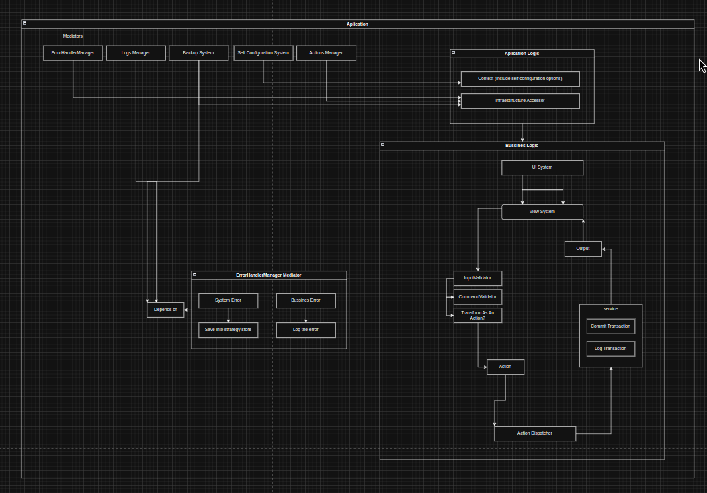

# my-budged-cli

my-budged-cli is a command-line interface (CLI) application built with TypeScript. This project is a learning experiment to design a complex, modular application while covering topics like error handling, logging, and dynamic configuration. The application leverages a clean architecture that separates business logic from infrastructure concerns.

## Architecture

The core of my-budged-cli is its extensible infrastructure, built using the Mediator pattern. Key components include:

### ErrorHandlerManager:
Acts as the central mediator for error handling. It receives error events from across the application, differentiating between system errors (unexpected issues) and business errors (e.g., bad HTTP responses or invalid user inputs). This component delegates errors to registered error handlers such as loggers or backup systems.

### Logs Manager:
Centralizes logging operations, ensuring that events and errors are recorded uniformly for monitoring and troubleshooting.

### Backup System:
Handles the backup of critical data and system states, improving the application's resilience and recovery capabilities.

### Self Configuration System:
Allows runtime configuration changes, such as adjusting logging levels or feature flags, enabling more flexible operation without code modifications.

### Actions Manager & Dispatcher:
Orchestrates the execution and dispatching of user commands, ensuring that each action flows through the necessary validators and business logic before execution.

## Features

### Centralized Error Handling:
All errors, whether system or business-related, are funneled through a single mediator (ErrorHandlerManager). This ensures consistent error processing and easier debugging.

### Modular & Extensible Design:
Each infrastructure component is decoupled, allowing you to add, remove, or modify functionality (e.g., adding a new error handler) without impacting other parts of the system.

### Robust Logging & Backup:
The integrated Logs Manager and Backup System provide reliable mechanisms for data persistence and recovery, essential for production-level applications.

### Dynamic Configuration:
The Self Configuration System allows for on-the-fly adjustments, making the application adaptable to changing environments and requirements.

## Contributing

Contributions are welcome! Feel free to open issues or submit pull requests to enhance functionality, fix bugs, or improve the design.

